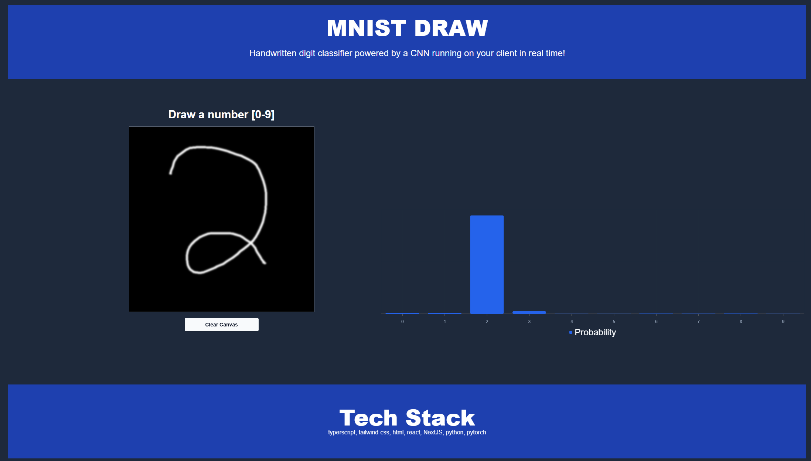

# Real-Time MNIST Number Detector

https://hunter-1298.github.io/MNIST-DRAW/

This project is a web application that allows users to draw digits on a canvas, and it detects the drawn number in real time using a trained MNIST model. The model predicts the number based on the drawn input, which is then processed through a neural network trained on the MNIST dataset.

The app utilizes ONNX (Open Neural Network Exchange) for model inference and uses a Gaussian blur on the user’s input to mimic the conditions of the MNIST training data.

## Features

- **Draw on Canvas**: Users can draw digits on a canvas using their mouse or touchscreen.
- **Real-Time Prediction**: As soon as the drawing stops, the app predicts the digit using an MNIST-trained neural network model.
- **Blurred Input**: The drawn input is automatically blurred to match the conditions of the MNIST training dataset, helping improve the prediction accuracy.
- **Interactive Chart**: Displays the predicted probabilities for each digit (0-9) in a bar chart.

## Tech Stack

- **Frontend**: React, Tailwind CSS
- **Canvas API**: Used for drawing and processing input.
- **ONNX Runtime**: Used for running the MNIST model in the browser.
- **Chart.js**: Visualizes the prediction probabilities with a bar chart.

## How It Works

1. **Drawing**: Users can draw a digit on the canvas. The canvas size is 500x500px, and the drawing is automatically adjusted to 28x28px, which matches the input size of the MNIST model.
2. **Blurring**: A Gaussian blur is applied to the drawn input to match the blur effect that was applied to the MNIST dataset during training.
3. **Prediction**: Once the user stops drawing, the app captures the drawn image, processes it, and sends it to an ONNX model for prediction.
4. **Output**: The predicted number is displayed, along with a probability distribution chart showing the confidence of each prediction (for digits 0-9).
